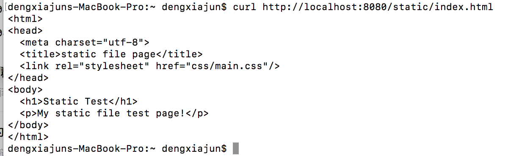
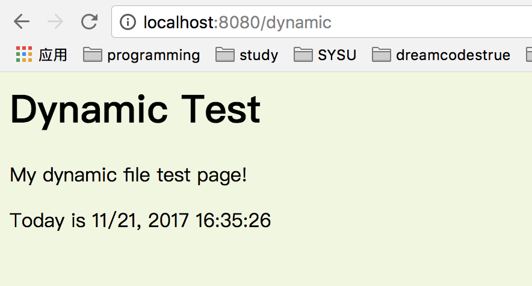
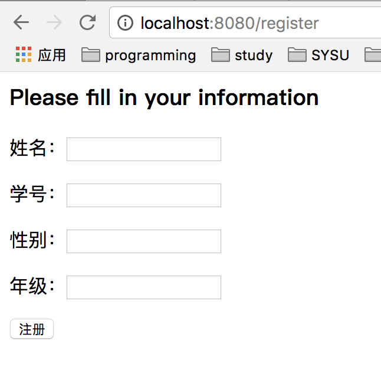
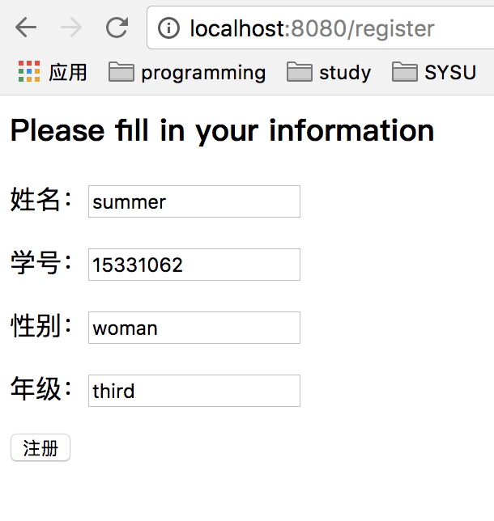
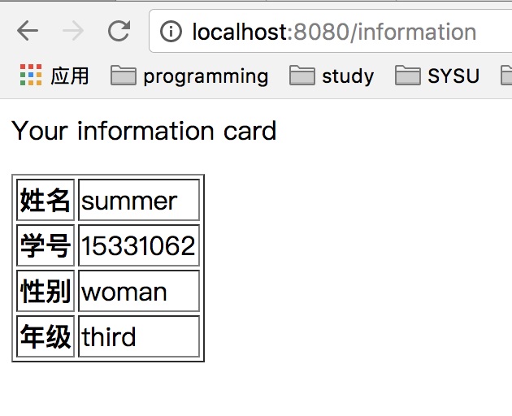
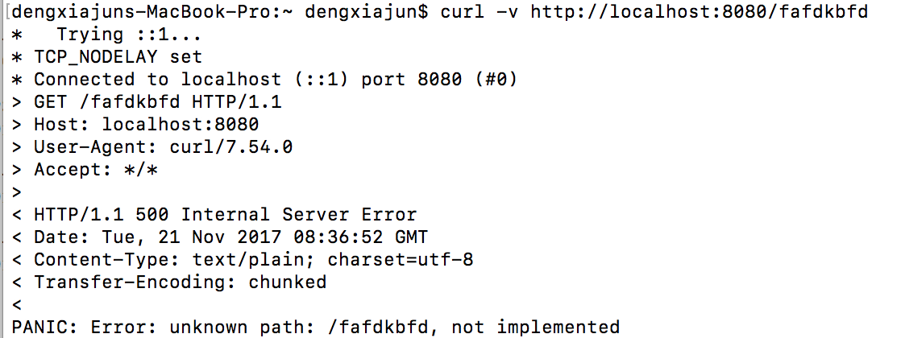

# Web Server 2
---
##### Requirement: implement a simple web server, it have
- 支持静态文件服务
- 支持简单 js 访问
- 提交表单，并输出一个表格
- 对 `/unknown` 给出开发中的提示，返回码 `5xx`

##### Develop Tool: Atom 1.21.0
---
这次主要是利用几个库——negroni、render、template、mux、router等完成一个能够和用户进行简单交互的服务器。

---
#### 效果展示
1. 默认在`8080`端口上运行

2. 支持静态文件访问

  **访问`http://localhost:8080/static/index.html`来进行测试**

 

3. 支持简单的js访问

  在这里我做了一个动态页面，页面上有一行用js生成的即时时间，时间即打开网页的当前时间，每次刷新的时候时间会更新，证明支持js访问。

  **访问`http://localhost:8080/dynamic`来进行测试**

  

4. 提交表单，并输出一个表格

  这里做了一个录入个人信息并生成个人信息表格的交互。

  **访问`http://localhost:8080/register`来进行测试**
  - 录入信息页面

  
  - 录入信息之后

  
  - 点击注册，出现信息表格

  

5. 对 `/unknown` 给出开发中的提示，返回码 `5xx`

  如果输入的路径是未知的，给出500的返回码

  **随便访问一个未知网址，这里为`http://localhost:8080/fafdkbfd`**

  
