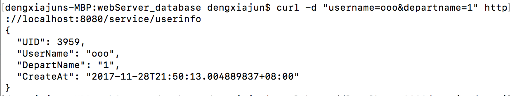
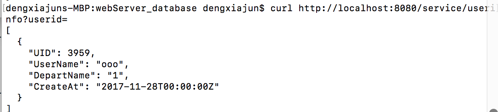
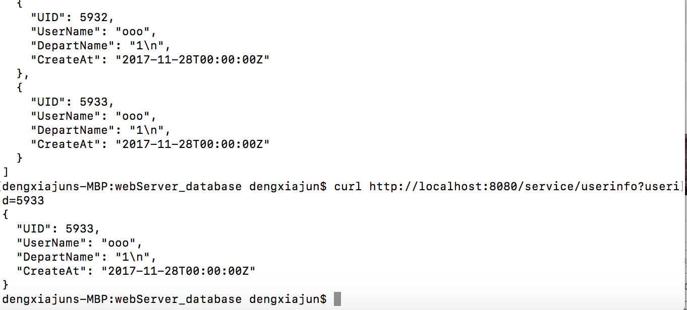
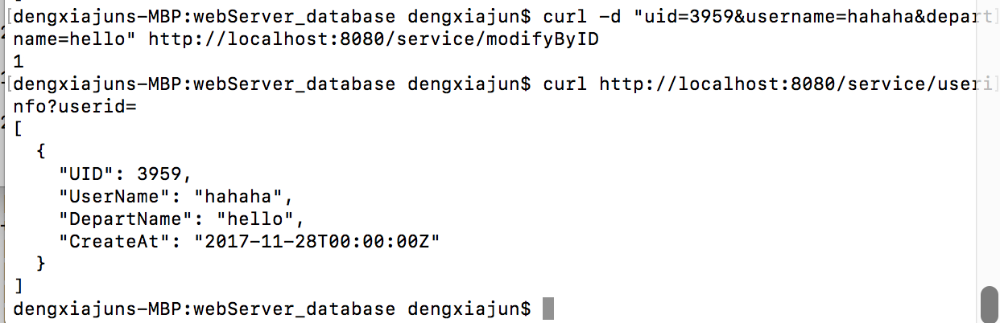
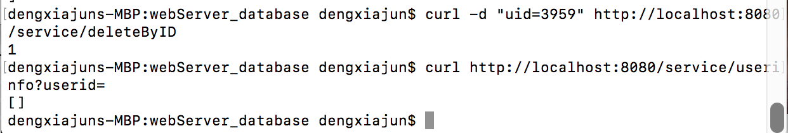
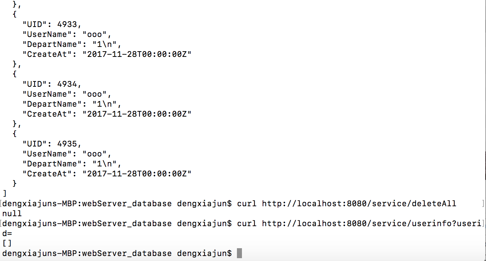

# Web Server - Database
----
##### Requirement: 分别用原生sql和orm实现通过服务器对docker上的数据库进行增删查改。

##### Develop Tool：Atom 1.21.0
---
在这次的作业里，我按照博客实现了一个使用原生sql进行增删查改的版本，放在sql文件夹中，还用xorm库实现了一个xorm版本，放在xorm版本中。通过在运行的时候指定method参数-m 来实现选择哪种版本。默认的版本为原生sql。
```
$ ./main
using sql implementation version
[negroni] listening on :8080


```
使用orm版本
```
$ ./main -m orm
using orm implementation version
[negroni] listening on :8080


```
---
#### 实现的功能
两个版本的数据库操作都可以进行插入、查找、修改和删除四种操作。其中查找操作可以通过id查找或者查找全部；删除操作可以通过id删除或者删除全部。

#### 增、删、查、改
- 对数据库进行插入操作

  `$ curl -d "username=ooo&departname=1" http://localhost:8080/service/userinfo`

  

- 对数据库进行查询操作

  `$ curl http://localhost:8080/service/userinfo?userid=` 返回全部

  

  `$ curl http://localhost:8080/service/userinfo?userid=5933` 返回一条记录

  

- 对数据库进行修改操作

  `$ curl -d "uid=3959&username=hahaha&departname=hello" http://localhost:8080/service/modifyByID`

  

- 对数据库进行删除操作

  `$ curl -d "uid=3959" http://localhost:8080/service/deleteByID`

  

- 删除所有数据

  `$ curl http://localhost:8080/service/deleteAll`

  

**以上测试结果是用sql版本测试的，orm版本输出相同**

---
#### 使用ab测试

- sql版本

```
$ ab -n 1000 -c 100 -p "post.txt" -T "application/x-www-form-urlencoded" http://localhost:8080/service/userinfo
This is ApacheBench, Version 2.3 <$Revision: 1757674 $>
Copyright 1996 Adam Twiss, Zeus Technology Ltd, http://www.zeustech.net/
Licensed to The Apache Software Foundation, http://www.apache.org/

Benchmarking localhost (be patient)
Completed 100 requests
Completed 200 requests
Completed 300 requests
Completed 400 requests
Completed 500 requests
Completed 600 requests
Completed 700 requests
Completed 800 requests
Completed 900 requests
Completed 1000 requests
Finished 1000 requests


Server Software:        
Server Hostname:        localhost
Server Port:            8080

Document Path:          /service/userinfo
Document Length:        3994 bytes

Concurrency Level:      100
Time taken for tests:   1.248 seconds
Complete requests:      1000
Failed requests:        997
   (Connect: 0, Receive: 0, Length: 997, Exceptions: 0)
Non-2xx responses:      3
Total transferred:      250508 bytes
Total body sent:        194000
HTML transferred:       126532 bytes
Requests per second:    801.46 [#/sec] (mean)
Time per request:       124.772 [ms] (mean)
Time per request:       1.248 [ms] (mean, across all concurrent requests)
Transfer rate:          196.07 [Kbytes/sec] received
                        151.84 kb/s sent
                        347.91 kb/s total

Connection Times (ms)
              min  mean[+/-sd] median   max
Connect:        0    0   0.6      0       3
Processing:     7  120  46.9    105     385
Waiting:        7  119  46.9    105     385
Total:          9  120  47.1    106     386

Percentage of the requests served within a certain time (ms)
  50%    106
  66%    128
  75%    151
  80%    159
  90%    188
  95%    206
  98%    229
  99%    277
 100%    386 (longest request)

```

- orm版本

```
$ ab -n 1000 -c 100 -p "post.txt" -T "application/x-www-form-urlencoded" http://localhost:8080/service/userinfo
This is ApacheBench, Version 2.3 <$Revision: 1757674 $>
Copyright 1996 Adam Twiss, Zeus Technology Ltd, http://www.zeustech.net/
Licensed to The Apache Software Foundation, http://www.apache.org/

Benchmarking localhost (be patient)
Completed 100 requests
Completed 200 requests
Completed 300 requests
Completed 400 requests
Completed 500 requests
Completed 600 requests
Completed 700 requests
Completed 800 requests
Completed 900 requests
Completed 1000 requests
Finished 1000 requests


Server Software:        
Server Hostname:        localhost
Server Port:            8080

Document Path:          /service/userinfo
Document Length:        82 bytes

Concurrency Level:      100
Time taken for tests:   1.176 seconds
Complete requests:      1000
Failed requests:        0
Total transferred:      205000 bytes
Total body sent:        194000
HTML transferred:       82000 bytes
Requests per second:    850.09 [#/sec] (mean)
Time per request:       117.635 [ms] (mean)
Time per request:       1.176 [ms] (mean, across all concurrent requests)
Transfer rate:          170.18 [Kbytes/sec] received
                        161.05 kb/s sent
                        331.24 kb/s total

Connection Times (ms)
              min  mean[+/-sd] median   max
Connect:        0    1   0.8      0       7
Processing:    34  113  57.8     91     302
Waiting:       33  113  57.8     91     302
Total:         34  114  58.0     91     302
WARNING: The median and mean for the initial connection time are not within a normal deviation
        These results are probably not that reliable.

Percentage of the requests served within a certain time (ms)
  50%     91
  66%    128
  75%    150
  80%    168
  90%    205
  95%    231
  98%    255
  99%    262
 100%    302 (longest request)

```

在我的测试结果里，orm版本的表现比原生sql版本的要好一点点。虽然照理说，orm的性能应该不会比原生好...那可能，是我写的问题吧orz...不过这么一点点的差别，也可以忽略了...
